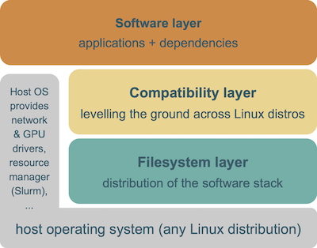

# Introduction to EESSI

## What is EESSI?

The European Environment for Scientific Software Installations (EESSI) project is a collaboration between various
(mostly) European HPC sites and partners, to build a **shared stack of scientific software installations**.

The main idea is to work together and avoid duplicate work across HPC sites, even more so than we already do via
EasyBuild.

For end users, we want to provide a **uniform user experience** with respect to available scientific software, regardless of which system they use.

EESSI should work on laptops, personal workstations, HPC clusters and in the cloud, which means we will need to support different CPUs, networks, GPUs, and so on.
We hope to make this work for any Linux distribution, and maybe even macOS and Windows via [WSL](https://docs.microsoft.com/en-us/windows/wsl/),
and a wide variety of CPU architectures (Intel, AMD, ARM, POWER, RISC-V).

We focus point on the **performance** of the provided software installations, but also on automating the workflow
for maintaining the software stack, thoroughly testing the installations, and collaborating efficiently.

## Inspiration

The EESSI concept is heavily inspired by Compute Canada (now [Digital Research Alliance of Canada](https://alliancecan.ca/en)) software stack,
which is a shared software stack used on all 5 major national systems (and a bunch of smaller ones) in Canada.

The design of the Compute Canada software stack is discussed in detail
in the PEARC'19 paper [*"Providing a Unified Software Environment for Canada’s
National Advanced Computing Centers"*](https://ssl.linklings.net/conferences/pearc/pearc19_program/views/includes/files/pap139s3-file1.pdf).

It has also been presented at the 5th EasyBuild User Meetings ([slides](https://users.ugent.be/~kehoste/eum20/eum20_03_maxime_computecanada.pdf), [recorded talk](https://www.youtube.com/watch?v=_0j5Shuf2uE&list=PLhnGtSmEGEQidEM8MZKkOaVutgt9WmqI0)), and is [well documented](https://docs.computecanada.ca/wiki/Accessing_CVMFS).

## High-level design

The EESSI project consists of 3 layers.

The bottom layer is the **filesystem layer**,
which is responsible for distributing the software stack across clients.

The middle layer is a **compatibility layer**,
which ensures that the software stack is compatible with multiple different
client operating systems.

The top layer is the **software layer**, which contains the actual scientific software applications and their dependencies.

The host OS still provides a couple of things, like drivers for network and GPU, support for shared filesystems like GPFS and Lustre, a resource manager like Slurm, and so on.

### Filesystem layer

The bottom layer of the EESSI project is the **filesystem layer**,
which is responsible for distributing the software stack.

For this we rely on [CernVM-FS](https://cernvm.cern.ch/portal/filesystem) (or CVMFS for short), a network file system used to distribute the software to the clients in a fast, reliable and scalable way.

CVMFS was created by CERN over a decade ago, specifically for the purpose of globally distributing a large software stack. For the experiments at the Large Hadron Collider, it hosts several hundred million files and directories that are distributed to the order of a 100,000 client computers.

The hierarchical structure with multiple caching layers (Stratum-0, Stratum-1's located at partner sites, and local caching proxies) ensures good performance with limited resources. Redundancy is provided by using multiple Stratum-1's at various sites. Since CVMFS is based on the HTTP protocol, the ubiquitous [Squid caching proxy](http://www.squid-cache.org/) can be leveraged to reduce server loads and improve performance at large installations (such as HPC clusters). Clients can easily mount the file system (read-only) via a [FUSE](https://en.wikipedia.org/wiki/Filesystem_in_Userspace) (Filesystem in Userspace) module.

For a (basic) introduction to CernVM-FS, see [this presentation](https://www.youtube.com/watch?v=MyYx-xaL36k).

Detailed information about how we configure CVMFS is available at
[https://github.com/EESSI/filesystem-layer](https://github.com/EESSI/filesystem-layer) .

### Compatibility layer

The middle layer of the EESSI project is the **compatibility layer**,
which ensures that our scientific software stack is compatible with
different (versions of) client operating systems (different Linux distributions,
macOS and even Windows via [WSL](https://docs.microsoft.com/en-us/windows/wsl/)).

For this we rely on [Gentoo Prefix](https://wiki.gentoo.org/wiki/Project:Prefix),
by installing a limited set of Gentoo Linux packages in a non-standard location
(a "prefix"), using Gentoo's package manager [Portage](https://wiki.gentoo.org/wiki/Portage).

The compatible layer is maintained via our [https://github.com/EESSI/compatibility-layer](https://github.com/EESSI/compatibility-layer) GitHub repository.

### Software layer

The top layer of the EESSI project is the **software layer**,
which provides the actual scientific software installations.

To install the software we include in our stack,
we use [**EasyBuild**](https://easybuild.io),
a framework for installing scientific software on HPC systems.
These installations are optimized for a particular system architecture
(specific CPU and GPU generation).

To access these software installation we provide *environment module files*
and use [**Lmod**](https://lmod.readthedocs.io), a modern environment modules tool which has been widely
adopted in the HPC community in recent years.

We leverage the [**archspec**](https://archspec.readthedocs.io) Python library
to automatically select the best suited part of the software stack for
a particular host, based on its system architecture.

The software layer is maintained through our [https://github.com/EESSI/software-layer](https://github.com/EESSI/software-layer) GitHub repository.

## Current status

The EESSI project was started mid 2020, as a loose collaboration between various Dutch universities including
the [University of Groningen](https://www.rug.nl/society-business/centre-for-information-technology), [VU
Amsterdam](https://vu.nl/en), [TU Delft](https://www.tudelft.nl/en/), [TU Eindhoven](https://www.tue.nl/en/), and
[HPC-UGent](https://www.ugent.be/hpc/en), as a follow-up of a meeting organised in Delft in early March 2020
under the impuls of [Dell Technologies](https://www.dell.com).

*European Environment for Scientific Software Installations (EESSI)* was chosen as project name, and a GitHub
organisation ([https://github.com/EESSI](https://github.com/EESSI)) and Slack were set up to kickstart the
collaboration. Since April 2020, [online meetings](https://github.com/EESSI/meetings/wiki) have been held to share
progress updates and discuss next steps.

In July 2020 a proof-of-concept [EESSI pilot repository](https://eessi.github.io/docs/pilot/) was set up,
to explore technical aspects, automate the process of setting up the EESSI layers and installing software into EESSI.

In February 2022, an open access paper on EESSI was published (https://doi.org/10.1002/spe.3075).

During the first half of 2022, the most active partners in the EESSI project worked together on a project proposal
to start a EuroHPC Centre-of-Excellence in which EESSI could be developed further. The proposal was accepted,
and hence the [MultiXscale](https://www.multixscale.eu/) EuroHPC Centre-of-Excellence was started. This is a 4-year
project (2023-2026) that is a collaboration between EESSI and [CECAM](https://www.cecam.org/), with goals
that include making EESSI ready for production, and supporting community contributions.

[*next: Getting access to EESSI*](eessi-getting-access.md) - [*(back to overview page)*](index.md)
